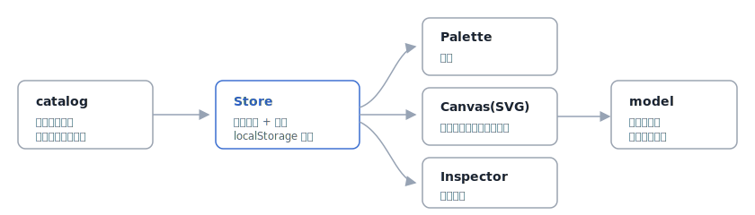

# unkai

[](https://github.com/miruky/unkai/actions/workflows/ci.yml)
[](https://www.typescriptlang.org/)
[](https://vitest.dev/)
[](https://opensource.org/licenses/MIT)

**AWS・GCP・Azureのサービスをホワイトボードに並べ、矢印で繋いで構成を設計するブラウザツールです。**

## 概要

パレットからサービスを置き、ポートをドラッグして矢印で繋ぐと、クラウド構成図がそのまま編集可能なデータになります。各ノードを選ぶと、そのサービス固有の設定項目(Lambdaのメモリやランタイム、S3のストレージクラスなど)を編集でき、内容はブラウザに自動保存されます。構成チェックで接続のない孤立ノードを洗い出し、JSONとして書き出し・読み込みもできます。サーバーを持たず、図の状態はすべて手元で完結します。

サービスと設定項目はコード中のカタログにデータとして定義してあり、項目を増やすにはその配列に足すだけです。クラウドの全サービスを一度に網羅することは現実的ではないため、主要カテゴリの代表的なサービスを起点に、拡張しやすい構造そのものを設計の核に据えています。

遊ぶ: https://miruky.github.io/unkai/

### なぜ作ったのか

クラウド構成の検討は、図を描くツールと設定を書くツールが分かれていて、図はただの絵、設定は別のどこか、という分断が起きがちです。図のノードがそのまま設定を持つ編集可能なオブジェクトであれば、設計と記録が一つになります。3クラウドを同じ画面で扱えるのは、移行や比較の検討にも効きます。それを軽量なブラウザツールで実現したくて作りました。

## 使い方

- **配置** — 左のパレットでサービスをクリックすると、中央に置かれます。検索欄で名前やカテゴリから絞り込めます
- **移動** — ノードをドラッグして動かします。ノードを選んで矢印キーでも動かせます(Shift で微調整)。背景のドラッグでパン、ホイールでズーム
- **接続** — ノード右側の出力ポートから、別ノード左側へドラッグして矢印を引きます。詳細パネルの「ここから接続」やノード上で `c` キーを押すと接続モードに入り、接続先をクリック・タップ・Enter で確定できます
- **設定** — ノードを選ぶと右の詳細パネルで設定項目と表示名を編集できます
- **複製 / 削除** — 選択して Cmd/Ctrl + D で複製、Delete または Backspace で削除します。Escape で選択を解除します
- **取り消し / やり直し** — Cmd/Ctrl + Z で取り消し、Shift を足すとやり直しです(ツールバーのボタンからも操作できます)
- **構成チェック** — 接続のない孤立ノードを洗い出します
- **共有** — 「共有」で図を URL に載せたリンクをコピーします。そのリンクを開くと同じ図が復元されます
- **書き出し / 読み込み** — 図を JSON ファイルとして保存・復元します
- **テーマ** — 右端のボタンで自動(OS追従)・ライト・ダークを切り替えます。選択は記憶されます
- **ヘルプ** — ツールバーのヘルプボタンで、操作とショートカットの一覧を開きます

## アーキテクチャ



サービス定義(`catalog`)・図のデータ構造(`model`)・状態管理(`Store`)を中心に置き、UI(パレット・キャンバス・詳細パネル)は状態を読んで描画し、操作を状態へ反映するだけにしています。キャンバスはSVGで、パン・ズームはviewBox、ノードと矢印はそれぞれSVG要素として描きます。モデルと座標計算はDOMから独立しているため、接続規則や直列化をブラウザなしでテストできます。

## 技術スタック

| カテゴリ | 技術 |
|:--|:--|
| 言語 | TypeScript 5(strict) |
| 描画 | SVG(ライブラリ非依存) |
| ビルド | Vite |
| 保存 / 共有 | localStorage + JSON入出力 + URLリンク共有 |
| テスト | Vitest + happy-dom(46テスト) |
| リンタ | ESLint + Prettier |
| CI / CD | GitHub Actions |
| 配信 | GitHub Pages |

## プロジェクト構成

- `src/catalog.ts` — サービスと設定項目のデータ定義(拡張点)
- `src/model.ts` — 図のデータ構造、接続規則、直列化と検証
- `src/geometry.ts` — ノード寸法・ポート位置・矢印経路・座標変換
- `src/store.ts` — 状態管理・自動保存・取り消し / やり直しの履歴
- `src/canvas.ts` — SVGキャンバスの描画とポインタ操作
- `src/palette.ts` / `src/inspector.ts` / `src/toolbar.ts` — 各UIパネル
- `src/share.ts` — 図をURLへ載せる共有リンクの符号化
- `src/theme.ts` / `src/toast.ts` / `src/help.ts` — テーマ切替・通知・ヘルプ
- `src/main.ts` — 全体の組み立てとキーボード操作
- `docs/architecture.svg` — アーキテクチャ図

## はじめ方

### 前提条件

- Node.js 20 以上

### セットアップ

```bash
git clone https://github.com/miruky/unkai.git
cd unkai
npm install
npm run dev
```

### テストの実行

```bash
npm test
```

### Lintの実行

```bash
npm run lint
```

### デプロイ

`main` ブランチへのプッシュで GitHub Actions がビルドし、GitHub Pages へ配信します。

## 設計方針

- **データ駆動のカタログ** — サービスと設定項目を1か所のデータに集約し、UIとモデルはそれを読むだけにする。網羅範囲はデータの追加で広げる
- **状態の一元管理** — 図・選択・ビューをStoreに集め、UIは購読して描画する一方向の流れにする
- **モデルとUIの分離** — 接続規則・直列化・座標計算をDOM非依存にし、テストで担保する
- **壊れた保存データに強い** — 復元時に未知サービスや端点を失った辺を取り除き、欠けた設定は既定で補う
- **配色はトークンで一元化** — セマンティックな配色変数を1か所に置き、`prefers-color-scheme` でライト・ダークへ自動追従する
- **取り消しはスナップショット** — 変更の直前に図の複製を履歴へ積み、同じ入力欄の連打は1つにまとめる。差分を持たないぶん挙動が読みやすい
- **キーボードとタッチでも操作** — ノードはフォーカスでき、選択・移動・接続をキーボードから行える。接続はマウスのポートドラッグに加え、接続モードでクリック・タップ・キー操作にも対応する

## 制約

実在するクラウドの全サービス・全設定項目を網羅するものではなく、主要サービスの代表的な設定を扱います。コスト見積もりやデプロイ連携は行わず、設計と記録に用途を絞っています。

## ライセンス

[MIT](LICENSE)
